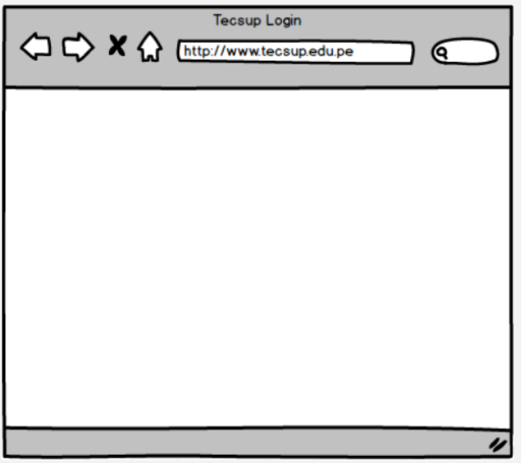
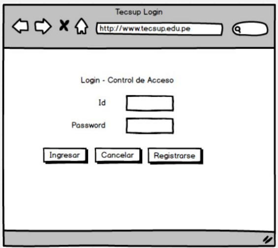
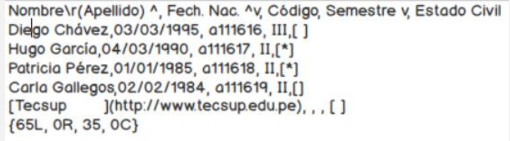
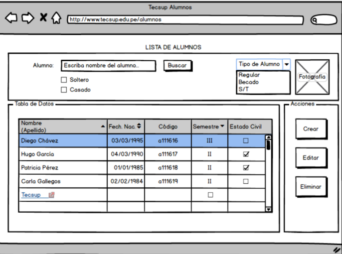

# Reglas de el diseño de interfaces de usuario
## Paso 1: Dibujar Contenedores
En la barra de herramientas en la cinta ALL arrastre un control Browser al Mockup 1 (creado por defecto al iniciar
el programa). Aparecerá la pantalla de un navegador.
En la Lista de Mockups creados clic derecho al mockup “New Mockup 1” y clic en Rename para darle el nombre
de “Mockup Login”
En el cuadro de texto escriba “Tecsup – Login” como Título y en el URL Escriba http://www.tecsup.edu.pe.
 

## Paso 2: Dibujar Controles
Arrastre los siguientes controles al buscador:
| **Control**   | **Valor**            |
|---------------|----------------------|
| Label         | Id                  |
| Label         | Password            |
| Label         | Login – Control de Acceso |
| TextBox       |                      |
| TextBox       |                      |
| Button        | Ingresar            |
| Button        | Cancelar            |
| Button        | Registrarse         |

En la esquina superior derecha clic en el signo “+” para crear un nuevo Mockup.
En la Lista de Mockups creados clic derecho al mockup “New Mockup 2” y clic en Rename para darle el nombre
de “Mockup Alumnos”.
Arrastre un Control Browser, un tanto más grande que el Mockup 1
En el cuadro de texto escriba “Tecsup Alumnos” como Título y en el URL Escriba
http://www.tecsup.edu.pe/alumnnos
Arrastre los siguientes controles:
- Label con el Valor “LISTA DE ALUMNOS” en la parte central superior del nuevo formulario.
- “Rectangle” y ubíquelo después del Label creado.
- Label con valor “Alumno”
- TextBox con valor “Escriba nombre del alumno”
- Button con valor “Buscar”.
- 2 CheckBox’s con valores:
    o Soltero.
    o Casado.
- Image con valor “Fotografía”
- ComboBox con valores:
    o Tipo de Alumno.
    o Regular
    o Becado
    o S/T
- Field Set con valor “Tabla de Datos”.
- Field Set con valor “Acciones”
- Dentro del Field Set Tabla de Datos un Data Grid con el siguiente Valor:

- Dentro del Field Set de Acciones 3 Buttons con los valores:
    o Crear
    o Editar
    o Eliminar
Finalmente Seleccione el Data Grid y modifique los siguientes valores:
- Marque la casilla de Horizontal Lines.
- En Selection, Seleccione el primer registro “Diego Chávez”
- Active la casilla Scroll Bar,  
- Y centre el texto del Grid

  