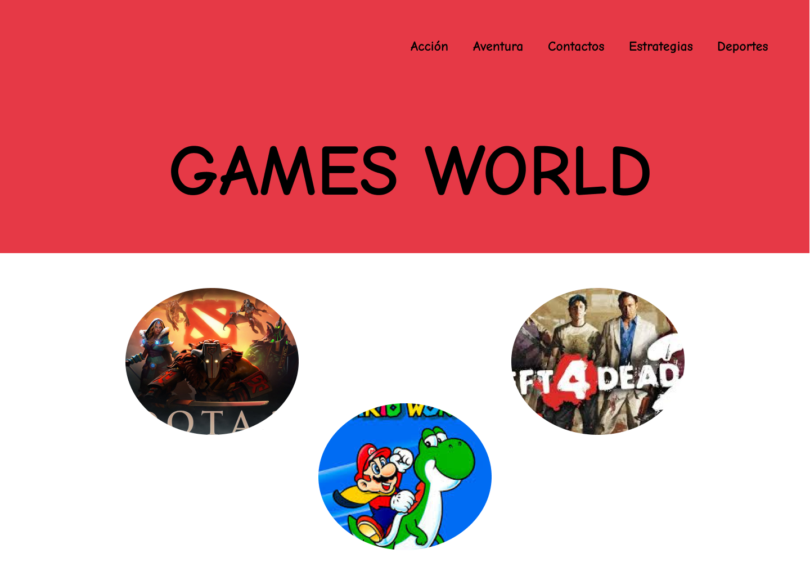

# Guía de Laboratorio de la Semana N° 03: Herramientas de Maquetación 🎮

## Competencias ✅

* **Identificar** herramientas de maquetación.

## Equipos, Materiales, Programas y Recursos 💻

* **Equipos**: PC Personal.
* **Sistema Operativo**: Windows 7.
* **Materiales**: Disponible en Tecsup Virtual.
* **Software Requerido**: [**Figma**](https://www.figma.com/). 🎨

## Seguridad 🚨

* **Mochilas**: Coloca las mochilas en el gabinete para evitar caídas en caso de sismo.
* **Prohibido**: No ingresar con bebidas ni comidas.
* **Apagar Equipos**: Al culminar la sesión, asegúrate de apagar los equipos y monitores.

## Preparación 📚

Antes de la sesión, el alumno debe revisar el material teórico disponible en **Tecsup Virtual** y asegurarse de tener acceso a su texto.

## Caso Práctico 🖥️

### Instrucciones:

1. **Registrarse en Figma**:

   * Ingresa a [**Figma**](https://www.figma.com/) usando tu correo institucional.

2. **Configurar el lienzo**:

   * Utiliza la herramienta **Frame** para seleccionar el diseño **Desktop**.
   * A continuación, configura **12 columnas** usando la herramienta **Layout Grid** y selecciona la opción **Columns**.

3. **Dibujar un rectángulo**:

   * Dibuja un rectángulo en la parte superior con un tamaño de **450px** y color **rojo**.
   * Inserta el texto **“GAMES WORLD”** con las siguientes características:

     * **Tamaño**: 128px.
     * **Fuente**: Comic Neue.
     * **Estilo**: **Bold**.

4. **Crear la barra de navegación**:

   * Usa la herramienta **Texto** para crear los siguientes elementos en la barra de navegación:

     * **Acción**, **Aventura**, **Deportes**, **Estrategias**, **Contactos**.
   * Selecciona todos los textos y agrúpalos usando la combinación de teclas **Ctrl + G**.
   * Coloca el grupo de texto en la parte izquierda.

5. **Insertar imágenes**:

   * Inserta imágenes de internet de los juegos correspondientes a cada categoría del menú.
   * Usa la herramienta **Elipse** para dibujar círculos y selecciona cada círculo.
   * Haz clic en la herramienta **Image/Video** y busca la imagen en internet.
   * Coloca la imagen dentro del círculo y haz clic para insertarla.

6. **Crear una nueva página**:

   * Crea una nueva página para **Videojuegos de Acción**.
   * Utiliza la herramienta **Texto** para agregar la información correspondiente.

7. **Enlazar la opción “Acción”**:

   * Enlaza la opción **Acción** de la barra de navegación con la página creada de **Videojuegos de Acción**.
   * Haz clic derecho en el borde superior izquierdo de la nueva página y copia el enlace (link).
   * Regresa a la página principal, selecciona **Acción** en la barra de navegación y presiona **Ctrl + K** para pegar el enlace copiado.
   * Verifica que al hacer clic en la opción **Acción** se redirija correctamente.

8. **Enlazar otras opciones**:

   * Repite el proceso para enlazar las demás opciones de la barra de navegación con las páginas correspondientes.
   * No olvides eliminar las columnas si las usaste. Para ello, presiona la combinación **Ctrl + Shift + 4**.

---

### Resultado del diseño en Figma 🌟

#### **Accede al proyecto en Figma**:

[**Proyecto Figma**](https://www.figma.com/design/YQblwyexrjRNfgcgWmWrC7/Untitled?node-id=1-2&t=kts1mlRWGMUSo1EV-1)

---

## Conclusiones 📝

* **Figma** es una herramienta increíblemente poderosa para prototipar proyectos y facilitar la maquetación de interfaces de usuario, permitiendo un trabajo colaborativo eficiente y la creación de diseños interactivos con facilidad. 🎨✨
* **Interactividad y prototipado rápido**: Figma permite la creación de prototipos funcionales sin la necesidad de escribir código, lo que agiliza el proceso de prueba y presentación.
* La posibilidad de **trabajar en equipo en tiempo real** convierte a Figma en una herramienta ideal para proyectos colaborativos. 🤝
* **Personalización visual**: Desde la creación de marcos hasta la inserción de imágenes, Figma ofrece una gran flexibilidad para diseñar interfaces visualmente atractivas. 🎮

