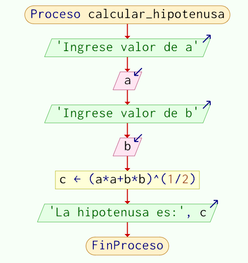

## Creación de diagramas de flujo

### I.- OBJETIVOS:
● Crear, compilar, ejecutar y depurar programas elaborados en Diagramas de flujo con Pseint

### II.- EJERCICIOS

#### 1. Cálculo de la hipotenusa

Se desea crear un algoritmo que calcule la hipotenusa de un triángulo rectángulo dados los valores de los catetos 'a' y 'b'.

```pseudocode
Proceso calcular_hipotenusa
    Escribir 'Ingrese valor de a'
    Leer a
    Escribir 'Ingrese valor de b'
    Leer b
    c <- (a * a + b * b)^(1/2)
    Escribir 'La hipotenusa es:', c
FinProceso
```
 