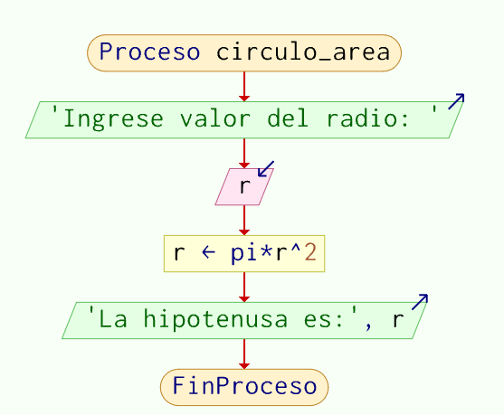
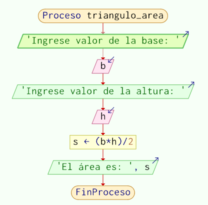
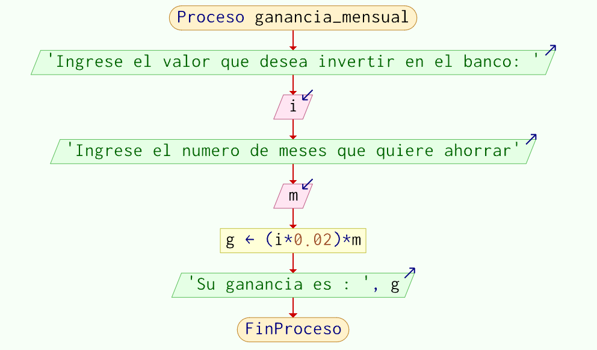
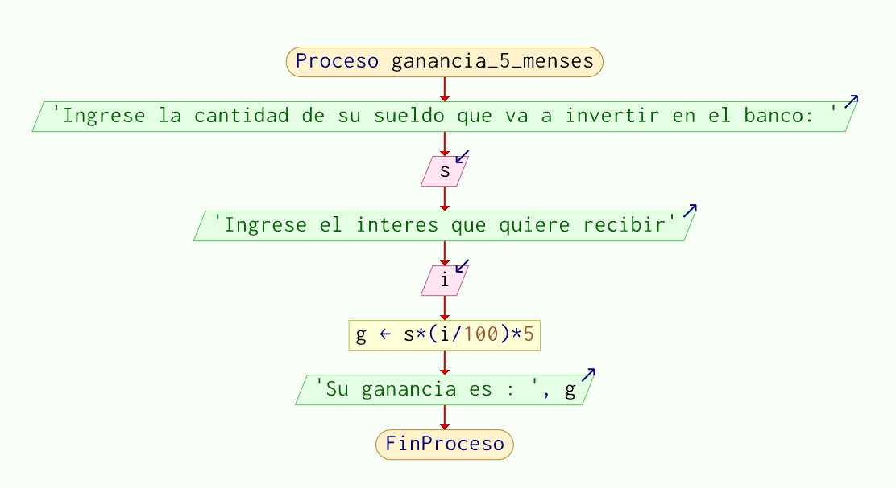
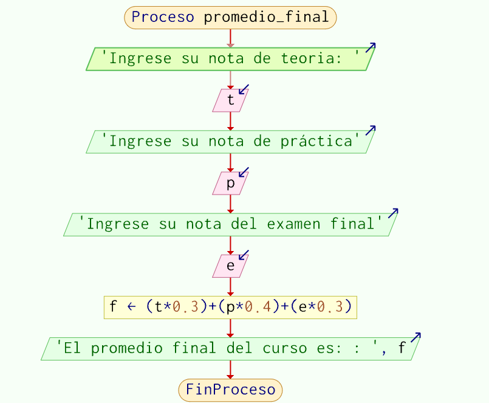

## Creación de diagramas de flujo

### I.- OBJETIVOS:
● Crear, compilar, ejecutar y depurar programas elaborados en Diagramas de flujo con Pseint

### II.- EJERCICIOS

#### 1. Cálculo de la hipotenusa

Se desea crear un algoritmo que calcule la hipotenusa de un triángulo rectángulo dados los valores de los catetos 'a' y 'b'.

```pseudocode
Proceso calcular_hipotenusa
    Escribir 'Ingrese valor de a'
    Leer a
    Escribir 'Ingrese valor de b'
    Leer b
    c <- (a * a + b * b)^(1/2)
    Escribir 'La hipotenusa es:', c
FinProceso
```

 

#### 2. Cálculo del área de un círculo

Se desea crear un algoritmo que calcule el área de un círculo.

```pseudocode
Proceso circulo_area
    Escribir 'Ingrese valor del radio: '
    Leer r
    s <- pi * r^2
    Escribir 'El área del círculo es :', s
FinProceso
```

 

  

#### 3. Cálculo del área de un triángulo

Se desea crear un algoritmo que calcule el área de un triángulo.

```pseudocode
Proceso triangulo_area
	Escribir 'Ingrese valor de la base: '
	Leer b
	Escribir 'Ingrese valor de la altura: '
	Leer h
	s <- (b*h)/2
	Escribir 'El área es: ', s
FinProceso
```

 

#### 4. Cálculo de la  ganancia mensual.

Un empleado desea invertir su dinero ahorrándolo en el banco: sabiendo que el banco le pagará a razón de 2% mensual, hacer un programa que ingresado el sueldo de una persona se obtenga la ganancia mensual.

```pseudocode
Proceso ganancia_mensual
	Escribir 'Ingrese el valor que desea invertir en el banco: '
	Leer i
	Escribir 'Ingrese el numero de meses que quiere ahorrar'
	Leer m
	g<- (i*0.02)*m
	Escribir 'Su ganancia es : ', g
FinProceso
```

 

#### 5. Cálculo de la ganancia mensual a 5 meses

Modifique el algoritmo anterior para que el usuario pueda ingresar el sueldo, el interés que el banco le paga mensual y el monto total que recibirá al cabo de 5 meses.

```pseudocode
Proceso ganancia_5_menses
	Escribir 'Ingrese la cantidad de su sueldo que va a invertir en el banco: '
	Leer s
	Escribir 'Ingrese el interes que quiere recibir'
	Leer i
	g<- s*(i/100)*5
	Escribir 'Su ganancia es : ', g
FinProceso
```

 
 
 #### 6. Cálculo del monto final

Una tienda ofrece el 15% de descuento en compras generales. Desarrollar el algoritmo para que un usuario, dado el monto total de sus productos, obtenga el monto final con el descuento de la tienda.

```pseudocode
Proceso monto_final
	Escribir 'Ingrese el monto total de sus productos: '
	Leer m
	f<- m-(m*0.15)
	Escribir 'El monto final a pagar con el descuento de 15% es : ', f
FinProceso
```

 

  #### 7. Cálculo del promedio final

Un alumno desea saber cuál será su nota final en el curso de algoritmos. Se debe tener en cuenta los siguientes criterios:
a.	La Nota de teoría del curso equivale   30%
b.	La nota de práctica del curso equivale 40%
c.	La nota del examen final del curso equivale 30%
Desarrollar el algoritmo que dadas las tres notas obtenga el promedio final en el curso.

```pseudocode
Proceso promedio_final
	Escribir 'Ingrese su nota de teoria: '
	Leer t
	Escribir 'Ingrese su nota de práctica'
	Leer p
	Escribir 'Ingrese su nota del examen final'
	Leer e
	f<- (t*0.3)+(p*0.4)+(e*0.3)
	Escribir 'El promedio final del curso es: : ', f
FinProceso

```

 

 ### III.- CONCLUCIONES
 Los diagramas de flujo son graficos que ayudan a representar el orden del psudocodigo para poder analizarlos visualmente 